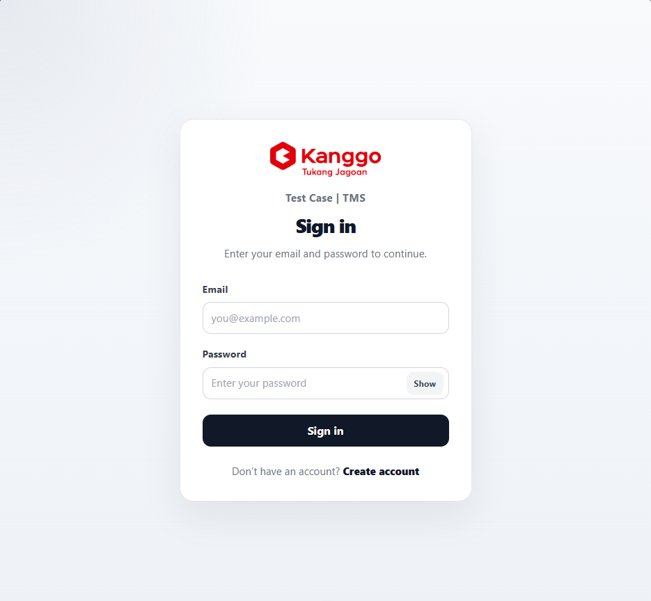
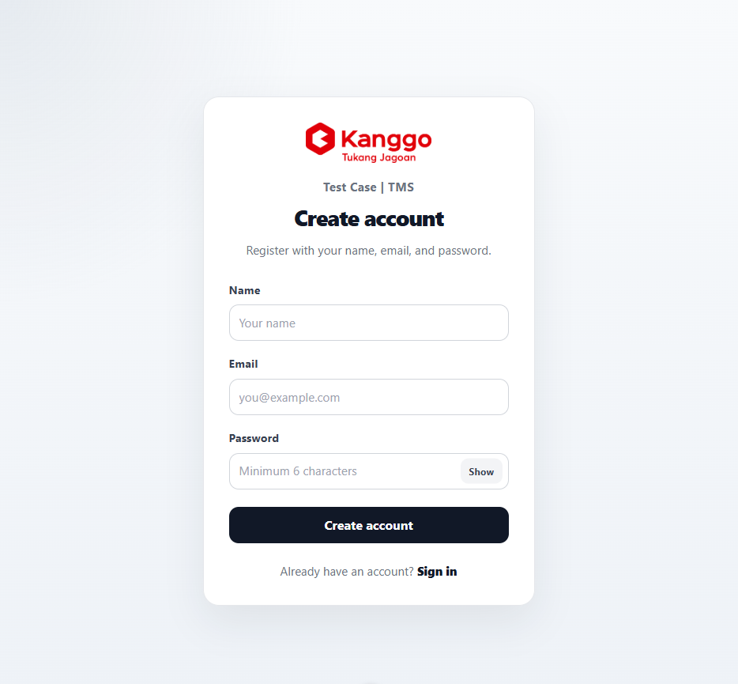
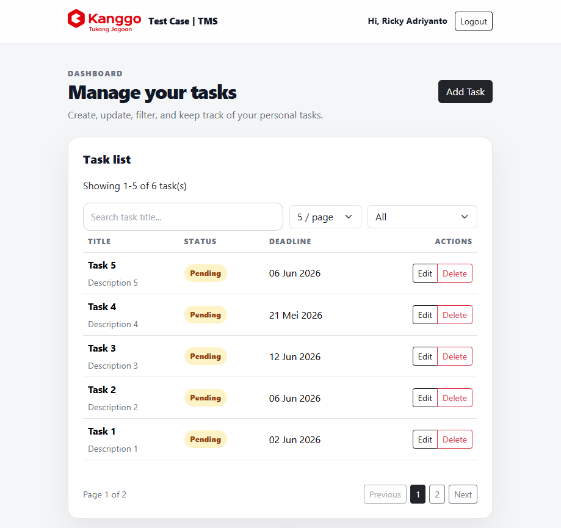
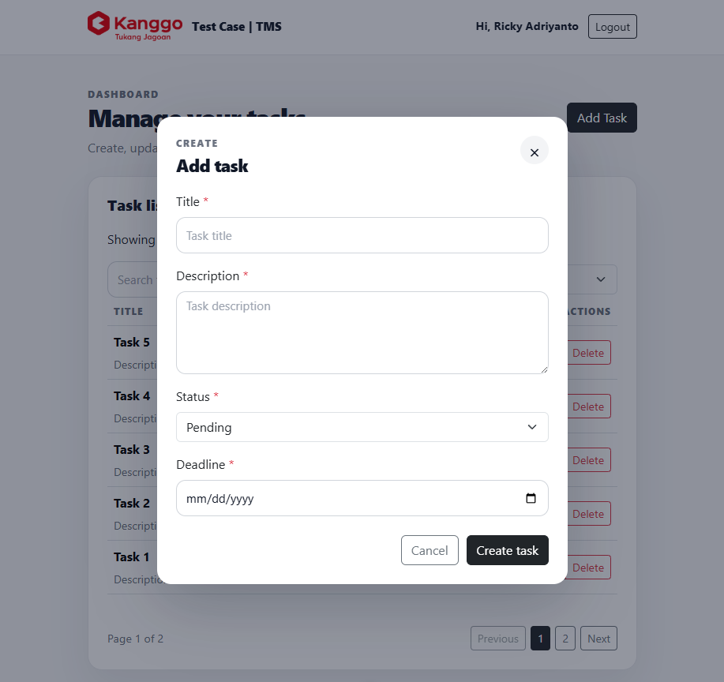

# Task Management System

Task Management System is a full-stack web application that allows users to manage their personal tasks through a simple and secure interface.

Users can register, log in, create tasks, update task details, filter tasks by status, and delete tasks. Each task is protected by authentication and belongs only to the logged-in user.

This project is developed as part of the **Fullstack Web Developer Technical Test for PT Kanggo**.

## Tech Stack

### Frontend

- Vue.js 3
- Vue Router
- Pinia
- Axios
- Bootstrap
- Custom CSS

### Backend

- Node.js
- Express.js
- MongoDB Atlas
- Mongoose
- JWT
- bcrypt
- dotenv
- cors
- zod

## Project Structure

This repository is organized as a monorepo with separate frontend and backend applications.

```txt
task-management-system/
  backend/
  frontend/
  docs/
  README.md
```

Documentation:

- [Frontend Documentation](./frontend/README.md)
- [Backend Documentation](./backend/README.md)

## Application Features

- User registration
- User login with JWT authentication
- Client-side logout
- Protected task dashboard
- Create task
- View logged-in user's tasks
- Update task
- Delete task with confirmation
- Filter tasks by status:
  - Pending
  - In Progress
  - Done
  - All
- User-based task isolation using `user_id`
- Basic validation and error handling
- Responsive UI

## Screenshots

### Login Page



### Register Page



### Task Dashboard



### Task Modal



## API Documentation

API documentation is provided as a Postman Collection.

Postman Collection file:

```txt
docs/postman/task-management-system.postman_collection.json
```

### How to Use the Postman Collection

1. Open Postman.
2. Import the collection file from:

   ```txt
   docs/postman/task-management-system.postman_collection.json
   ```

3. Make sure the collection variable `base_url` is set to:

   ```txt
   http://localhost:5000/api
   ```

4. Run the `Register` request to create a test user.
5. Run the `Login` request to receive a JWT token.

   The login request will automatically save the JWT token into the collection variable `token`.

6. After login, run the task endpoints:

   - `GET /tasks`
   - `GET /tasks?status=pending`
   - `GET /tasks?status=in-progress`
   - `GET /tasks?status=done`
   - `POST /tasks`
   - `PUT /tasks/:id`
   - `DELETE /tasks/:id`

7. When `Create Task` is successful, the created task ID will automatically be saved into the collection variable `task_id`, so it can be used by the `Update Task` and `Delete Task` requests.

### Notes

- Protected task endpoints require a valid JWT token.
- The JWT token is stored automatically after running the `Login` request.
- If the token expires, run the `Login` request again to refresh the token.

## Local Setup

This project contains two applications:

- Backend API: `backend/`
- Frontend app: `frontend/`

Please follow each documentation file for setup instructions:

- [Backend Setup Guide](./backend/README.md)
- [Frontend Setup Guide](./frontend/README.md)

## Run with Docker

Make sure Docker Desktop is installed and running.

From the root project folder:

```bash
docker compose up --build